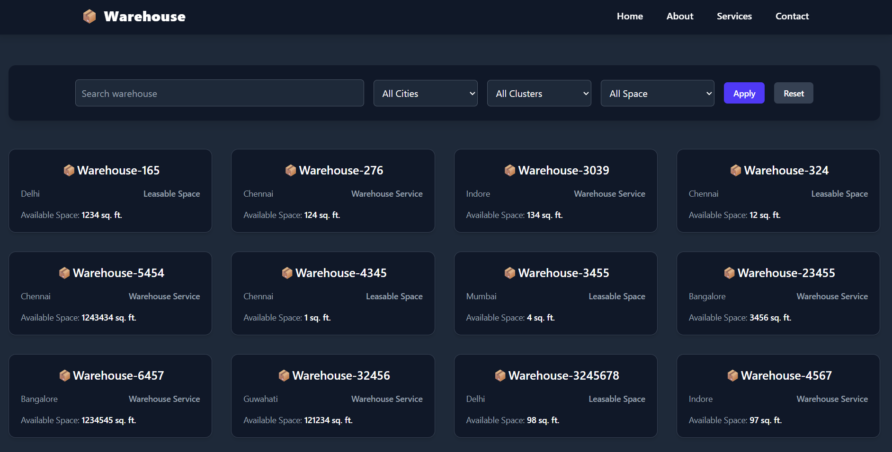
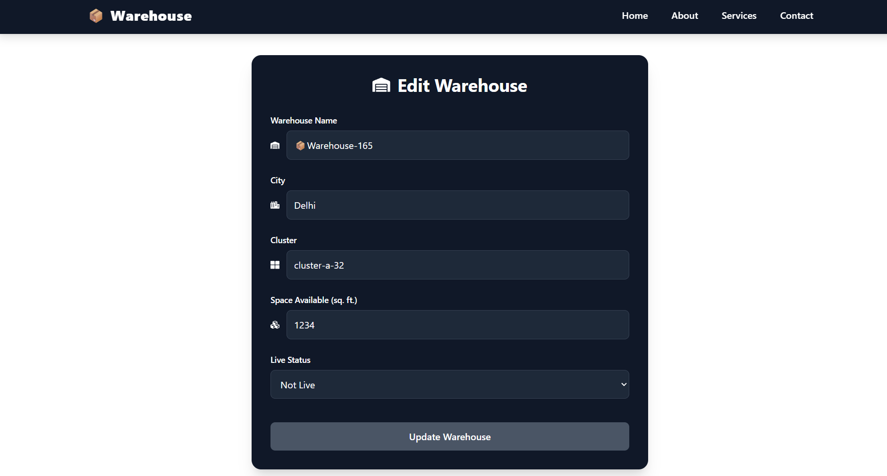

# 📦 Warehouse Dashboard

A responsive, modern Warehouse Management Dashboard built with **React**, **Redux**, **Tailwind CSS**, and **React Router**. This dashboard allows users to view, search, filter, and update warehouse details efficiently.

## 🔗 Hosted Link

[Live Preview](https://warehouse-react-namira.vercel.app/) 

---

## 📌 Project Overview

The Warehouse Dashboard is a web application designed to manage and explore warehouse data. It offers functionalities such as:

- Viewing a grid of warehouses
- Searching by name
- Filtering by city, cluster, and space availability
- Editing and updating individual warehouse details

This project simulates a basic CRUD interface with global state management and clean UI design patterns.

---

## 🖼️ Screenshots

### 🔍 Warehouse Dashboard

### ✏️ Edit Warehouse Page

---

## ⚙️ Functionalities

- ✅ **Filter Warehouses** by city, cluster, or available space
- ✅ **Search** warehouses by name
- ✅ **View** details in card layout
- ✅ **Edit** and update warehouse information
- ✅ **Responsive Design** for mobile, tablet, and desktop
- ✅ **Dark theme** aesthetic using Tailwind CSS

---

## 📦 Packages Used

- `react`
- `redux` / `@reduxjs/toolkit`
- `react-redux`
- `react-router-dom`
- `tailwindcss`
- `react-icons`

---

## 🧠 What I Learned

- How to structure a React + Redux project with good separation of concerns
- Tailwind CSS utility-first styling for responsive and modern UIs
- Creating dynamic filters and handling controlled form inputs
- Managing global state using Redux Toolkit
- Routing and navigation with React Router
- Conditional rendering and responsive UI techniques

---

## 🚀 Future Improvements

- Add **authentication** for admin access
- Connect to a **real backend API**
- Add **pagination** and **sorting**
- Implement **warehouse deletion**
- Integrate **charts** or visual analytics for available space

---
